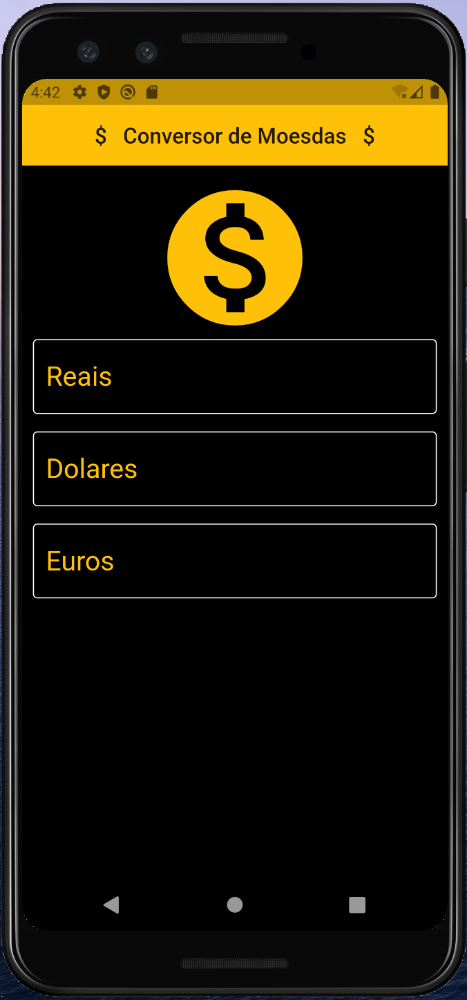
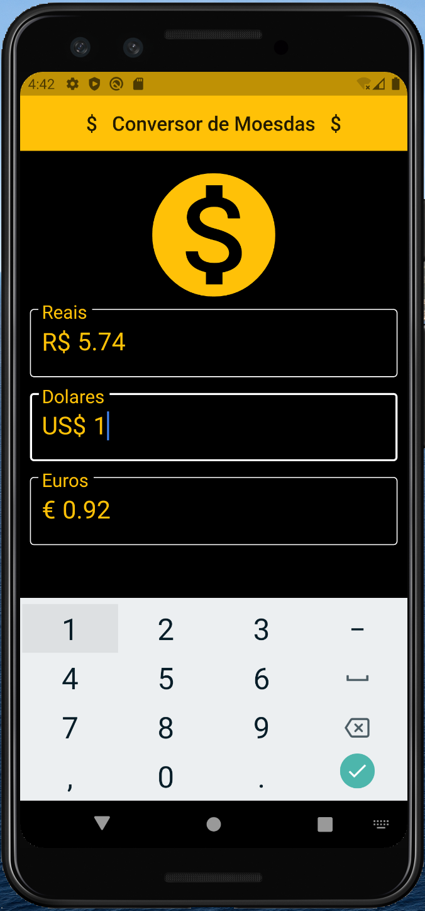

# conversordemoeda

A new Flutter application.

## Getting Started

# Conversor de Moeda

Aplicativo para converter o valor das moedas: Real, Dolar e Euro. 

## Getting Started

Para obter ajuda sobre como iniciar o Flutter, consulte nossa [documentação](https://flutter.io/) on-line .

## Screenshots

| Tela 1 | Tela 2 | Tela 3 |
| --------|--------|--------|
|||img src="screenshot/ConversorDeMoedas_Tela3.png" width="320">|

